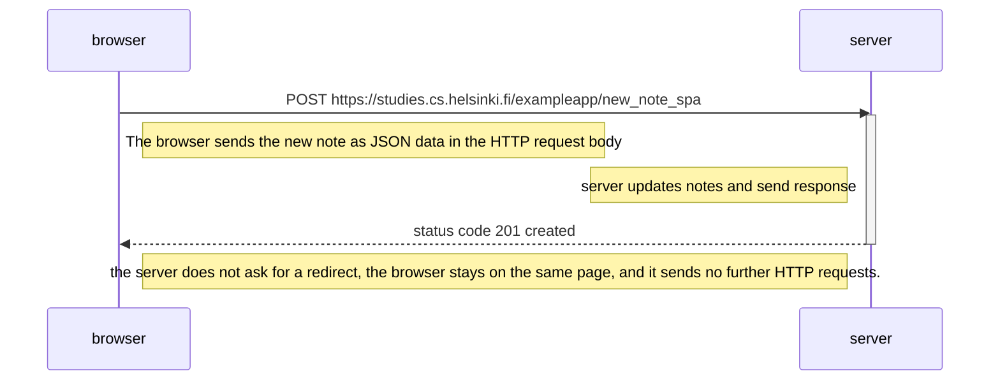

```mermaid
sequenceDiagram
    participant browser
    participant server

    browser->>server: POST https://studies.cs.helsinki.fi/exampleapp/new_note_spa
    activate server
    Note right of browser: The browser sends the new note as JSON data in the HTTP request body
    Note left of server: server updates notes and send response
    server-->>browser: status code 201 created
    deactivate server

    Note right of browser: the server does not ask for a redirect, the browser stays on the same page, and it sends no further HTTP requests.
   
```